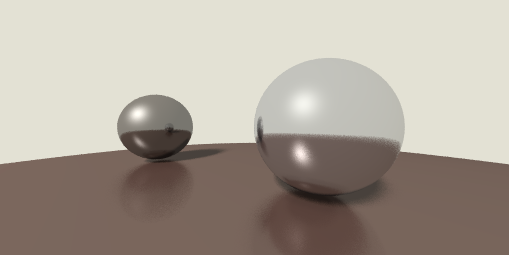

# 祝哥牛逼渲染器

祝哥牛逼渲染器是一个基于光线追踪的离线软件渲染器（暂时是）

> 至于为什么要叫这个名字，不要问，问就是祝哥牛逼

以下是这个渲染器最后实现的渲染效果：

在仓库的 `tutorial` 目录下我记录了如何一步步实现这个渲染器，其中可能涉及到一些诸如光线追踪，渲染管线，Blinn-Phone着色模型等概念，我会在分享会上和大家一起交流（但是分享会并不会讲解如何实现这个渲染器，这部分内容已经在教程中有所体现）

1. [安装开发环境](tutorial/01%20安装开发环境.md)
2. [显示图像数据](tutorial/02%20显示图像数据.md)
3. [渲染管线与渲染通道](tutorial/03%20渲染管线与渲染通道.md)
4. [组织场景数据](tutorial/04%20组织场景数据.md)
5. [深度图与法线图](tutorial/05%20深度图与法线图.md)
6. [光照与材质](tutorial/06%20光照与材质.md)
7. [Blinn-Phong反射模型](tutorial/07%20Blinn-Phong反射模型.md)
8. [光线的多重反射](tutorial/08%20光线的多重反射.md)
9. [超采样抗锯齿](tutorial/09%20超采样抗锯齿.md)
10. [硬阴影的实现](tutorial/10%20硬阴影的实现.md)
11. [分布式光线追踪](tutorial/11%20分布式光线追踪.md)

在之后的分享中，我也将通过这个玩具渲染器给大家分享一些我在学习过程中遇到的问题与疑惑，欢迎各种 `merge request`