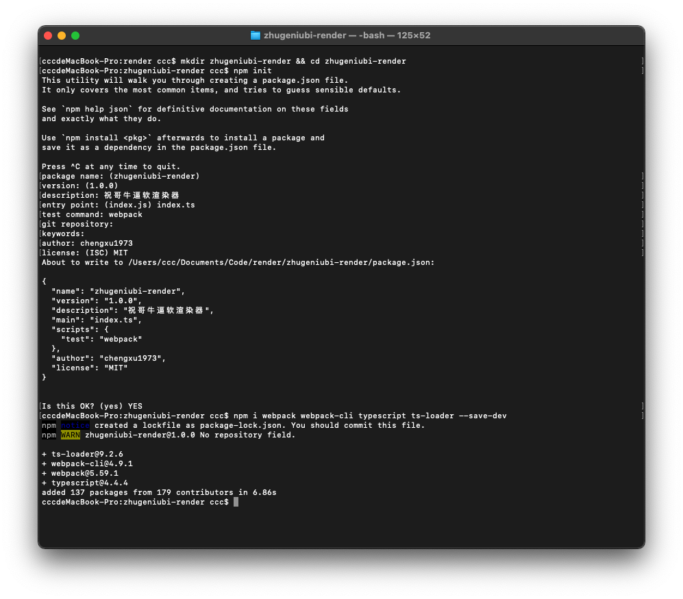
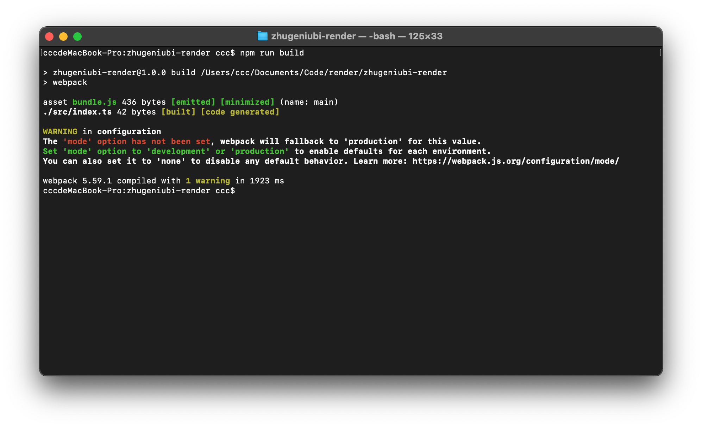
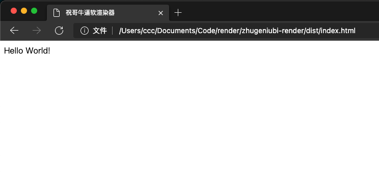

# 01 安装开发环境

首先我们创建一个目录，初始化 `npm`，然后 在本地安装 `webpack`，接着安装 `webpack-cli`，最后安装 TypeScript 编译器(compiler)和 loader

```bash
mkdir zhugeniubi-render && cd zhugeniubi-render
## 初始化npm
npm init -y
## 安装ts以及webpack等依赖项
npm install webpack webpack-cli typescript ts-loader --save-dev
```



安装完成后，创建以下目录结构与文件：

```bash
  |- /dist
    |- index.html
  |- /src
    |- index.ts
  |- package.json
  |- tsconfig.json
  |- webpack.config.js
```

分别修改文件内容:

```html
<!-- dist/index.html -->

<!DOCTYPE html>
<html>
  <head>
    <title>祝哥牛逼软渲染器</title>
  </head>
  <body>
    <script src="bundle.js"></script>
  </body>
</html>
```

```typescript
// src/index.ts

document.body.innerText = "Hello World!";
```

```json
// package.json

{
  "name": "zhugeniubi-render",
  "version": "1.0.0",
  "description": "祝哥牛逼软渲染器",
  "private": true,
  "scripts": {
    "build": "webpack"
  },
  "author": "chengxu1973",
  "license": "MIT",
  "devDependencies": {
    "ts-loader": "^9.2.6",
    "typescript": "^4.4.4",
    "webpack": "^5.59.1",
    "webpack-cli": "^4.9.1"
  }
}
```

```json
// tsconfig.json

{
  "compilerOptions": {
    "outDir": "./dist/",
    "sourceMap": true,
    "noImplicitAny": true,
    "module": "es6",
    "target": "es5",
    "jsx": "react",
    "allowJs": true
  }
}
```

```javascript
// webpack.config.js

const path = require("path");

module.exports = {
  entry: "./src/index.ts",
  devtool: "inline-source-map",
  module: {
    rules: [
      {
        test: /\.tsx?$/,
        use: "ts-loader",
        exclude: /node_modules/,
      },
    ],
  },
  resolve: {
    extensions: [".tsx", ".ts", ".js"],
  },
  output: {
    filename: "bundle.js",
    path: path.resolve(__dirname, "dist"),
  },
};
```

修改完成后,在当前目录下执行 `npm run build`



打开 `dist/index.html` 文件,可以看见 "Hello World!" 字样,至此环境安装结束.


