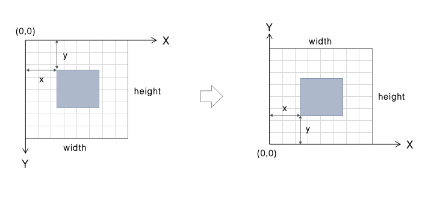
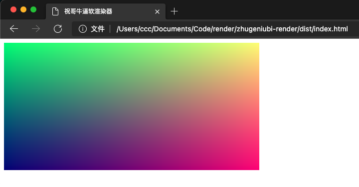

# 显示图像数据

为了方便地（意思就是不用 WebGL）在浏览器中进行图像的渲染，我们先把对 `<canvas>` 标签的相关操作进行封装

新建 `src/utils/canvas.ts` 文件:

```typescript
export class Canvas {
  public static readonly MIN_WIDTH: number = 400;

  public constructor(width: number, height: number) {
    this.width = width;
    this.height = height;
    this._createElement();
  }

  public readonly width: number;
  public readonly height: number;

  private _canvas: HTMLCanvasElement;
  public get canvas(): HTMLCanvasElement {
    return this._canvas;
  }

  private _context: CanvasRenderingContext2D;
  public get context(): CanvasRenderingContext2D {
    return this._context;
  }

  public render(pixels: Uint8ClampedArray) {
    pixels.forEach((v, i) => {
      this._image.data[i] = v;
    });
    this.context.putImageData(this._image, 0, 0);
  }

  private _image: ImageData;

  private _createElement() {
    this._canvas = document.createElement("canvas");
    // 设置画布内容宽高
    this._canvas.setAttribute("width", this.width.toString());
    this._canvas.setAttribute("height", this.height.toString());
    // 设置画布显示宽高
    const minW = Math.max(Canvas.MIN_WIDTH, this.width);
    const ratio = minW / this.width;
    this._canvas.style.width = `${ratio * this.width}px`;
    this._canvas.style.height = `${ratio * this.height}px`;
    // 关闭抗锯齿
    this._canvas.style.imageRendering = "pixelated";
    // 获取绘图上下文
    this._context = this._canvas.getContext("2d");
    this._image = this._context.getImageData(0, 0, this.width, this.height);
  }
}
```

这里需要注意的是, Canvas 内容的宽高由其 `width`与`height`属性控制,其在浏览器中显示的宽高由 css 控制.

通过 `canvas.getContext("2d")` 可以获取 Canvas 的绘图上下文,我们可以通过 `putImageData` 函数将 `ImageData` 绘制在画布上, `ImageData` 的 `data` 属性是一个 `Uint8ClampedArray` 类型的数组,每四位表示画布上一个像素的 rgba 值,范围为 0~255,为了方便操作,我们再添加一个`FrameBuffer` 类, 并将一些常量定义在 `src/utils/macros.ts` 中:

```typescript
import { Vec3 } from "../math/vec3";
import { CHANNEL_COUNT, IMAGE_HEIGHT, IMAGE_WIDTH } from "./macros";

export class FrameBuffer {
  public constructor(width = IMAGE_WIDTH, height = IMAGE_HEIGHT) {
    this.width = width;
    this.height = height;
    this._data = new Uint8ClampedArray(width * height * CHANNEL_COUNT);
  }

  private _data: Uint8ClampedArray;
  public get data(): Uint8ClampedArray {
    return this._data;
  }

  public readonly width: number;
  public readonly height: number;

  public walk(
    handler: (x: number, y: number, width: number, height: number) => Vec3
  ) {
    let i = 0;
    for (let y = this.height - 1; y >= 0; y--) {
      for (let x = 0; x < this.width; x++) {
        const color = handler(x, y, this.width, this.height);
        const a = 1;

        this._data[i++] = ~~(255.999 * color.x);
        this._data[i++] = ~~(255.999 * color.y);
        this._data[i++] = ~~(255.999 * color.z);
        this._data[i++] = ~~(255.999 * a);
      }
    }
  }
}
```

在 `FrameBuffer` 的 `walk` 函数中, 我们做了一次坐标转换, 转换之后, 画布的原点位于左下角, y 轴方向朝上, 我们传入的函数参数应当返回一个三维向量, 向量的 `x,y,z` 表示的是归一化之后的 rgb 值.



同时我们在 `src/math/` 目录下添加了 `vec3` 与 `ray` 两个常用类

> 一点题外话, 为何不在 vec3 中实现各个方法的 self 版本?
>
> 1.  祝哥牛逼软渲染器是一个演示用离线渲染器,只管撸代码,不管性能
> 2.  添加 self 方法后容易引起不必要的麻烦,在调试 blinn-phone 材质的时候我花了一整天时间,最后发现是因为用混了 self 函数

现在我们可以在 `src/index.ts` 中写一点测试代码来显示一张五彩斑斓的黑色图片:

```typescript
import { Vec3 } from "./math/vec3";
import { Canvas } from "./utils/canvas";
import { FrameBuffer } from "./utils/frame-buffer";
import { IMAGE_HEIGHT, IMAGE_WIDTH } from "./utils/macros";

const canvas = new Canvas(IMAGE_WIDTH, IMAGE_HEIGHT);
document.body.appendChild(canvas.canvas);

const image = new FrameBuffer(IMAGE_WIDTH, IMAGE_HEIGHT);

image.walk((x: number, y: number, w: number, h: number) => {
  const r = x / IMAGE_WIDTH;
  const g = y / IMAGE_HEIGHT;
  const b = 0.5;
  return new Vec3(r, g, b);
});

canvas.render(image.data);
```

编译后刷新浏览器,我们就可以看到如下图像:


