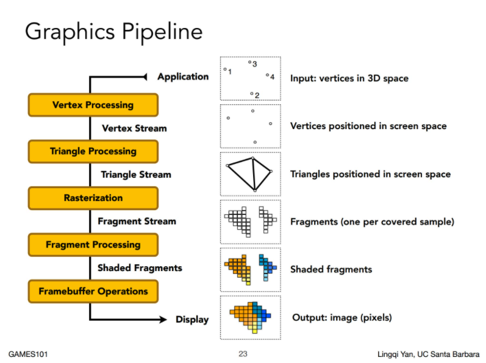
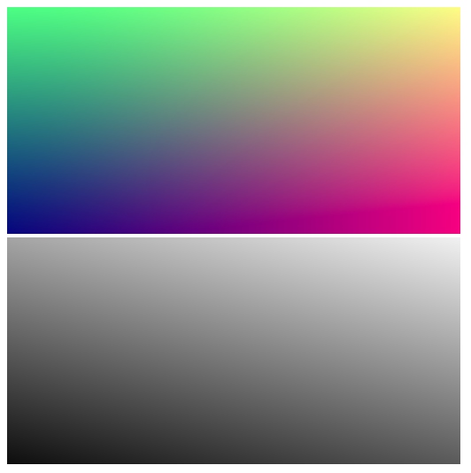

# 渲染管线与渲染通道

## 渲染管线的抽象

为了方便我们组织代码结构,我们需要先回顾一下经典的光栅化渲染管线



一般来说，渲染管线包括以下几个阶段的数据处理：

* 顶点数据
* 顶点着色器
* 曲面细分
* 几何着色器
* 图元组装
* 光栅化
* 片段着色器
* 测试混合阶段

以上几个阶段并不是一种严格的划分，概括地来说，渲染管线所做的事情就是：处理几何数据，光栅化，处理像素。

> 此处应有 PPT 讲解

可以看到，渲染管线就像是一条流水线，由很多逻辑步骤有序组成

回到祝哥牛逼渲染器的实现上，如果说渲染过程是一个工厂的流水线，那么这个流水线也是由一系列车间组成的，我们将流水线本身抽象为Flow，每一个车间抽象为一个Pass。

新建 `src/render/base-pass.ts` 文件：

```typescript
import { IStrMap } from "../../types";

export class BasePass<T extends IStrMap, K extends IStrMap> {
    public constructor(param: T) {
        this.input = param;
    }

    protected _output: K;
    public get output(): K {
        return this._output;
    }

    public readonly input: T;

    public process() { }
}

```

以及 `src/render/rende-flow.ts` 文件：

```typescript
import { IStrMap } from "../../types";
import { BasePass } from "./base-pass";

export abstract class BaseFlow<K extends IStrMap>{

    protected abstract passes: any[];

    protected abstract convertInput(stage: number): IStrMap;

    public uniforms: Partial<K>;

    public setUniforms(param: IStrMap) {
        this.uniforms = {
            ...(this.uniforms || {}),
            ...param,
        } as any;
    }

    public render(): K {
        let result: any = {};
        for (let i = 0; i < this.passes.length; i++) {
            const clazz = this.passes[i] as typeof BasePass;
            const input = this.convertInput(i);
            const stage = new clazz(input);
            stage.process();
            this.setUniforms(stage.output);
            result = {
                ...result,
                ...stage.output,
            }
        }
        return result;
    }
}
```

需要注意的是，我们在此处定义的flow与pass与其他API或者引擎中定义的flow和pass并不完全相同

> 现代的大部分游戏引擎或者图形API都有一个RenderPass的说法，直译就是渲染通道。其实这是一个比较宽泛的概念，我把它理解为渲染过程中的一个阶段，我们为了渲染一个物体或者实现特殊的效果，要经历好几个逻辑步骤，下一个步骤所需的数据由上一个步骤提供，一步步执行下来就得到了我们最终的结果。

## 实现灰度效果

有了基本的管线结构，现在我们可以尝试实现一些具体的渲染效果。

首先我们将 `src/index.ts` 里面的测试代码封装到管线当中，新建 `src/render/pass/hello-world-pass.ts` 文件:

```typescript
import { IEmpty, IHelloWorldOutput } from "../../../types";
import { Vec3 } from "../../math/vec3";
import { FrameBuffer } from "../../utils/frame-buffer";
import { IMAGE_HEIGHT, IMAGE_WIDTH } from "../../utils/macros";
import { BasePass } from "../base-pass";

export class HelloWorldPass extends BasePass<IEmpty, IHelloWorldOutput> {

    public process() {
        const helloWorld = new FrameBuffer(IMAGE_WIDTH, IMAGE_HEIGHT);
        helloWorld.walk((x: number, y: number, w: number, h: number) => {
            const r = x / IMAGE_WIDTH;
            const g = y / IMAGE_HEIGHT;
            const b = 0.5;
            return new Vec3(r, g, b);
        });
        this._output = { helloWorld };
    }

}
```

为了实现灰度的效果，我们再添加一个 `src/render/pass/hello-world-pass.ts` 文件：

```typescript
import { IGrayInput, IGrayOutput } from "../../../types";
import { Vec3 } from "../../math/vec3";
import { FrameBuffer } from "../../utils/frame-buffer";
import { BasePass } from "../base-pass";

export class GrayPass extends BasePass<IGrayInput, IGrayOutput> {

    public process() {
        const { grayInput } = this.input;
        const grayOutput = new FrameBuffer(grayInput.width, grayInput.height);

        grayOutput.walk((x, y) => {
            const pixel = grayInput.pixel(x, y);
            const gray = pixel.x * 0.3 + pixel.y * 0.59 + pixel.z * 0.11;
            return new Vec3(gray, gray, gray);
        })

        this._output = { grayOutput };
    }

}
```
然后我们需要将这两个pass添加到flow中，新建 `src/render/flow/hello-world-flow.ts` 文件：

```typescript
import { IGrayInput, IHelloWorldFlowResult, IStrMap } from "../../../types";
import { BaseFlow } from "../base-flow";
import { GrayPass } from "../pass/gray-pass";
import { HelloWorldPass } from "../pass/hello-world-pass";

export class HelloWorldFlow extends BaseFlow<IHelloWorldFlowResult> {

    protected passes = [
        HelloWorldPass,
        GrayPass,
    ];

    protected convertInput(stage: number): IStrMap {
        if (stage === 1) {
            const input: IGrayInput = {
                grayInput: this.uniforms.helloWorld
            };
            return input;
        }
        return this.uniforms;
    }

}
```

在 `src/index.ts` 中我们初始化一个 `HelloWorldFlow` 管线，然后将其渲染结果显示出来

```typescript
// src/index.ts

function main() {
    const helloWorld = new HelloWorldFlow();
    const result = helloWorld.render();
    renderImage(result.helloWorld);
    renderImage(result.grayOutput);
}

function renderImage(fb: FrameBuffer) {
    const canvas = new Canvas(IMAGE_WIDTH, IMAGE_HEIGHT);
    document.body.appendChild(canvas.canvas);
    canvas.render(fb.data);
}

main();
```

编译后刷新浏览器,我们就可以看到之前的图像变成了灰度图:


