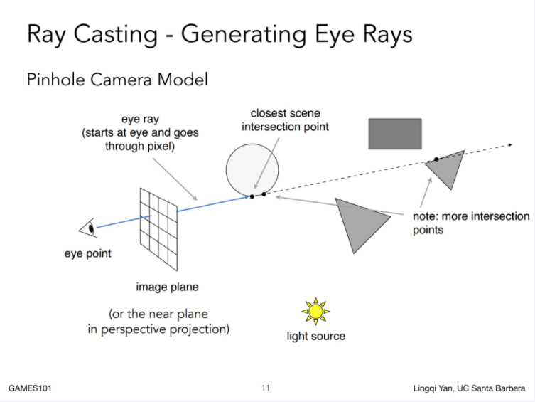
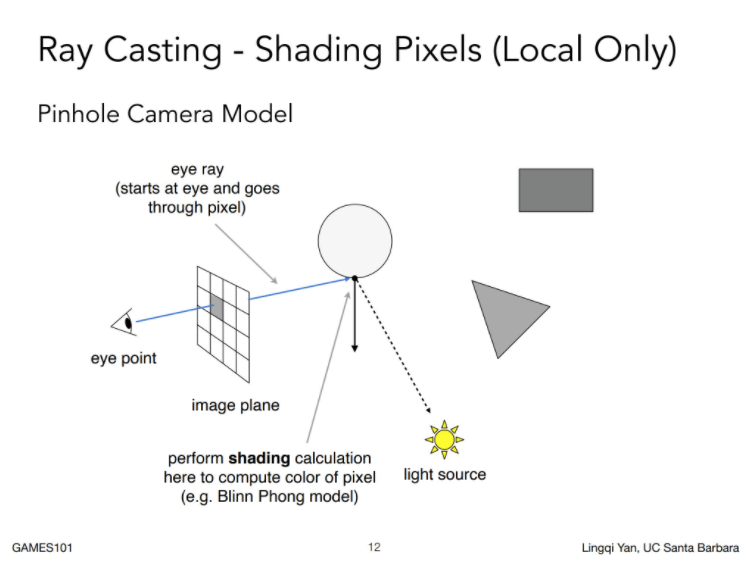

# 组织场景数据

通常我们的场景包括相机，模型，以及光源等元素，渲染其实就是从相机的视角将光线与模型的作用结果记录下来。

为了进行渲染，我们需要将相机，模型，光源等元素用代码表示出来，但是在此之前，我们需要先复习一下关于光线追踪的基本概念。

## 光线追踪

1. 从视点发射光线
2. 计算光线与场景物体的交点
3. 计算交点的颜色




> 此处应有 PPT 讲解

## 相机

相机的投影模式分为 透视投影（PERSPECTIVE） 和 正交投影（ORTHO），我们先只讨论透视投影的情况

新建 `src/utils/perspective-camera.ts` ：

```typescript
import { Ray } from "../math/ray";
import { Vec3 } from "../math/vec3";
import { IPerspectiveCameraParam } from "../types";

export class PerspectiveCamera {

    public constructor(param: IPerspectiveCameraParam) {
        this.origin = param.origin;
        this.front = param.front.normalize();
        this.refUp = param.refUp.normalize();
        this.fovY = param.fovY;
        this.aspect = param.aspect;
        this.near = param.near;
        this.far = param.far;
        this._init();
    }

    public origin: Vec3;
    public front: Vec3;
    public refUp: Vec3;
    public fovX: number;
    public fovY: number;
    public aspect: number;
    public near: number;
    public far: number;

    public up: Vec3;
    public right: Vec3;

    private _h: number;
    private _w: number;

    private _init() {
        this.right = this.front.cross(this.refUp).normalize();
        this.up = this.right.cross(this.front).normalize();
        this.fovX = 2 * Math.atan(this.aspect * Math.tan(this.fovY / 2));

        this._h = 2 * Math.atan(this.fovY * 0.5 * Math.PI / 180) * this.near;
        this._w = this.aspect * this._h;
    }

    public generateRay(x: number, y: number, width: number, height: number) {
        const u = (x + 0.5) / width;
        const v = (y + 0.5) / height;
        return new Ray(this.origin, this.origin
            .add(this.front.multiply(this.near))
            .add(this.right.multiply(this._w * (u - 0.5)))
            .add(this.up.multiply(this._h * (v - 0.5))));
    }

}
```

可以看见，相机的核心功能就是向场景发射光线。

## 模型

有了相机之后，我们需要在场景中放置一些几何体作为模型，我们先定义一个抽象的几何体类，由于我们会计算光线与各个几何体的碰撞情况，我们的几何体抽象类需要有一个计算射线相交的抽象函数，新建 `src/geometry/base-geometry.ts`:

```typescript
import { Ray } from "../math/ray";
import { IntersectResult } from "../utils/intersect-result";

export abstract class BaseGeometry {

    public abstract clone(): BaseGeometry;

    public abstract hit(ray: Ray): IntersectResult;

}
```

`hit` 函数返回的 `IntersectResult` 类定义在 `src/utils/intersect-result.ts`，用来记录碰撞的详细信息：

```typescript
import { BaseGeometry } from "../geometry/base-geometry";
import { Vec3 } from "../math/vec3";

export class IntersectResult {

    public target: BaseGeometry = null;
    public distance: number = 0;
    public hitPoint: Vec3 = Vec3.zero;
    public normal: Vec3 = Vec3.zero;

    public static readonly NONE = new IntersectResult();

}
```

由于场景中可能存在多个物体，我们再添加一个静态函数用于处理多个物体与光线相交的判断：

```typescript
// src/geometry/base-geometry.ts

public static hitMulti(ray: Ray, objects: BaseGeometry[]) {
    const records = objects.map(n => n.hit(ray));
    const hits = records.filter(r => !Object.is(r, IntersectResult.NONE));
    if (hits.length === 0) {
        return IntersectResult.NONE;
    }
    return hits.sort((a, b) => {
        return a.distance - b.distance;
    })[0];
}
```

有了基类之后，我们来实现一些具体的几何体

球体是最简单的几何体之一，我们先来搞个球，新建 `src/geometry/sphere.ts` :

```typescript
import { Ray } from "../math/ray";
import { Vec3 } from "../math/vec3";
import { IntersectResult } from "../utils/intersect-result";
import { BaseGeometry } from "./base-geometry";

export class Sphere extends BaseGeometry {

    public constructor(center: Vec3, radius: number) {
        super();
        this.center = center.clone();
        this.radius = radius;
    }

    public center: Vec3;

    public radius: number;

    public get sqrRadius() {
        return this.radius * this.radius;
    }

    public clone() {
        return new Sphere(this.center, this.radius);
    }

    public hit(ray: Ray): IntersectResult {
        const v = ray.origin.subtract(this.center);
        const a0 = v.sqrLength - this.sqrRadius;
        const DdotV = ray.direction.dot(v);

        if (DdotV <= 0) {
            const discr = DdotV * DdotV - a0;
            if (discr >= 0) {
                const result = new IntersectResult();
                result.target = this;
                result.distance = -DdotV - Math.sqrt(discr);
                result.hitPoint = ray.at(result.distance);
                result.normal = result.hitPoint.subtract(this.center).normalize();
                return result;
            }
        }

        return IntersectResult.NONE;
    }
}
```

到此为止，相机和物体已经准备就绪，在讨论光照与材质之前，我们先用相机和几何体搞点事情