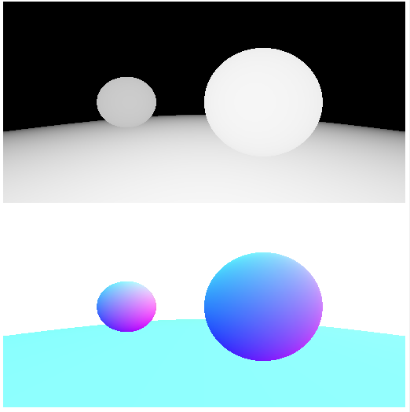

# 深度图与法线图

书接上回，我们先创建一个场景，新建 `src/scenes/BaseScene.ts` :

```typescript
import { BaseGeometry } from "../geometry/base-geometry";
import { Sphere } from "../geometry/sphere";
import { Vec3 } from "../math/vec3";
import { IScene } from "../types";
import { IMAGE_HEIGHT, IMAGE_WIDTH } from "../utils/macros";
import { PerspectiveCamera } from "../utils/perspective-camera";

export class BaseScene implements IScene {

    public camera: PerspectiveCamera = new PerspectiveCamera({
        origin: new Vec3(0, 0, 0),
        front: new Vec3(0, 0, -1),
        refUp: new Vec3(0, 1, 0),
        fovY: 120,
        aspect: IMAGE_WIDTH / IMAGE_HEIGHT,
        near: 1,
        far: 20,
    });

    public nodes: BaseGeometry[] = [
        new Sphere(new Vec3(-3, 0, -5), 1),
        new Sphere(new Vec3(1, 0, -2.5), 1),
        new Sphere(new Vec3(0, -100, -5), 100 - 1),
    ];
}
```
为了得到深度图与法线图，我们需要两个pass来分别计算摄像机视角下场景的深度与法线

深度就是从 `IntersectResult` 取得最近相交点的距离，由于深度的范围是[0, ∞]，为了可视化，可以把它的一个区间映射到[0, 1]，新建 `src/render/pass/depth-pass.ts` :

```typescript
import { BaseGeometry } from "../../geometry/base-geometry";
import { Vec3 } from "../../math/vec3";
import { IDepthOutput, IScene } from "../../types";
import { FrameBuffer } from "../../utils/frame-buffer";
import { IntersectResult } from "../../utils/intersect-result";
import { BasePass } from "../base-pass";

export class DepthPass extends BasePass<IScene, IDepthOutput> {

    public process() {
        const depth = new FrameBuffer();
        const { camera, nodes } = this.input;
        const { width, height } = depth;

        depth.walk((x, y) => {
            const ray = camera.generateRay(x, y, width, height);
            const hitResult = BaseGeometry.hitMulti(ray, nodes);

            if (Object.is(hitResult, IntersectResult.NONE)) {
                return new Vec3(0, 0, 0);
            }

            const { distance } = hitResult;

            const [min, max] = [camera.near, camera.far];

            if (distance > max) {
                return new Vec3(0, 0, 0);
            }
            if (distance < min) {
                return new Vec3(1, 1, 1);
            }
            const r = 1 - (distance - min) / (max - min);
            return new Vec3(r, r, r);
        });
        this._output = { depth };
    }

}
```

同理，我们可以将物体表面的法线可视化，由于法向量是一个单位向量，其每个元素的范围是[-1, 1]，我们依然需要将其映射到[0, 1]，新建 `src/render/pass/normal-pass.ts` :

```typescript
import { BaseGeometry } from "../../geometry/base-geometry";
import { Vec3 } from "../../math/vec3";
import { INormalOutput, IScene } from "../../types";
import { FrameBuffer } from "../../utils/frame-buffer";
import { IntersectResult } from "../../utils/intersect-result";
import { BasePass } from "../base-pass";

export class NormalPass extends BasePass<IScene, INormalOutput> {

    public process() {
        const normal = new FrameBuffer();
        const { camera, nodes } = this.input;
        const { width, height } = normal;
        normal.walk((x, y) => {
            const ray = camera.generateRay(x, y, width, height);
            const hitResult = BaseGeometry.hitMulti(ray, nodes);

            if (Object.is(hitResult, IntersectResult.NONE)) {
                return new Vec3(1, 1, 1);
            } else {
                return hitResult.normal
                    .subtract(camera.front)
                    .add(new Vec3(1, 1, 1))
                    .multiply(0.5);
            }
        });
        this._output = { normal };
    }

}
```

我们添加一个新的渲染流，新建 `src/render/flow/pretest-flow.ts` :

```typescript
import { IPreTestResult, IStrMap } from "../../types";
import { BaseFlow } from "../base-flow";
import { DepthPass } from "../pass/depth-pass";
import { NormalPass } from "../pass/normal-pass";

export class PreTestFlow extends BaseFlow<IPreTestResult> {

    protected passes = [
        DepthPass,
        NormalPass,
    ];

    protected convertInput(stage: number): IStrMap {
        return this.uniforms;
    }
}
```

最后，我们将 `src/index.ts` 的 `main` 函数改成：

```typescript
function main() {
    const preTest = new PreTestFlow();
    const scene = new BaseScene();
    preTest.setUniforms(scene);
    const testResult = preTest.render();
    renderImage(testResult.depth);
    renderImage(testResult.normal);
}
```

编译后刷新浏览器,我们现在就得到了场景的深度图与法线图：



为了给物品“真实”的颜色，我们接下来处理光照与材质
