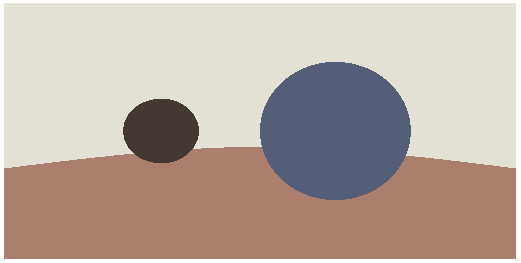

# 光照与材质

之前我们提到过，渲染其实就是从相机的视角将光线与模型的作用结果记录下来，因此我们先来定义光线

## 光线

从光源发出的光线通常包含很多信息，比如颜色、色温、强度、方向等等，为了简化操作，我们假设某一处的光线只包含两种信息：

* 光的颜色
* 光的方向

新建一个 `src/light/illumination.ts` 文件用于描述光照信息：

```typescript
import { Vec3 } from "../math/vec3";

export class Illumination {

    public constructor(color: Vec3, direction: Vec3) {
        this.color = color.clone();
        this.direction = direction.normalize();
    }

    public color: Vec3;

    public direction: Vec3;
}
```

光线是从光源发出的，常见的光源有平行光源，点光源，面光源等，为了处理方便，我们将光源发光的过程抽象为一个可以在某处产生光线的函数，新建 `src/light/base-light.ts` :

```typescript
import { Vec3 } from "../math/vec3";
import { Illumination } from "./illumination";

export abstract class BaseLight {

    public abstract at(position: Vec3): Illumination;

}
```

这样一来，给定任意一个光源与空间中的一个点，我们可以计算得出这一点受到此光源照射的光线

我们先实现一个简单的点光源，新建 `src/light/point-light.ts` :

```typescript
import { Vec3 } from "../math/vec3";
import { BaseLight } from "./base-light";
import { Illumination } from "./illumination";

export class PointLight extends BaseLight {

    public constructor(position: Vec3, color: Vec3, decay: (distance: number) => number) {
        super();
        this.position = position.clone();
        this.color = color.clone();
        this.decay = decay;
    }

    public position: Vec3;
    public color: Vec3;

    private decay: (distance: number) => number;

    public at(point: Vec3): Illumination {
        const dir = point.subtract(this.position);
        const decay = this.decay(dir.length);
        return new Illumination(this.color.multiply(decay), dir.normalize());
    }
}
```

在点光源的构造函数中，我们传入了点光源的位置，颜色，以及一个衰变函数，因为点光源的光线是向四面八方发射的，因此衰变函数只需要考虑受光点到光源的距离（distance）

## 材质

光线的部分搞定，我们接下来处理物体的材质。

简单来说，材质就是用来表现物体对光的交互，供渲染器读取的数据集，包括贴图纹理、光照算法等，而我们平时说的着色器（shader），是材质的一部分，是一段规定好输入和输出的程序。

我们先新建一个材质的基类 `src/meterial/base-material.ts`:

```typescript
import { Illumination } from "../light/illumination";
import { Ray } from "../math/ray";
import { Vec3 } from "../math/vec3";

export abstract class BaseMaterial {

    public abstract shade(ray: Ray, light: Illumination, position: Vec3, normal: Vec3): Vec3;

}
```

接下来我们来实现最简单的材质，不受光材质（unlit），新建 `src/material/unlit-material.ts` ：

```typescript
import { Illumination } from "../light/illumination";
import { Ray } from "../math/ray";
import { Vec3 } from "../math/vec3";
import { BaseMeterial } from "./base-material";

export class UnlitMaterial extends BaseMeterial {

    public constructor(color: Vec3) {
        super();
        this.color = color;
    }

    public readonly color: Vec3;

    public shade(ray: Ray, light: Illumination, position: Vec3, normal: Vec3): Vec3 {
        return this.color;
    }
}
```

不受光材质顾名思义，不受光照影响，无论什么时候都显示同样的颜色，十分real

接下来我们给物体加上材质的属性：

```typescript
// src/geometry/base-geometry.ts

public meterial: BaseMeterial;
```

然后我们给 `BaseScene` 里面的球加上材质：

```typescript
// src/scenes/BaseScene.ts
import { BaseGeometry } from "../geometry/base-geometry";
import { Sphere } from "../geometry/sphere";
import { BaseLight } from "../light/base-light";
import { PointLight } from "../light/point-light";
import { UnlitMaterial } from "../material/unlit-material";
import { Vec3 } from "../math/vec3";
import { IScene } from "../types";
import { IMAGE_HEIGHT, IMAGE_WIDTH } from "../utils/macros";
import { PerspectiveCamera } from "../utils/perspective-camera";

export class BaseScene implements IScene {

    public constructor() {
        this.camera = new PerspectiveCamera({
            origin: new Vec3(0, 0, 0),
            front: new Vec3(0, 0, -1),
            refUp: new Vec3(0, 1, 0),
            fovY: 120,
            aspect: IMAGE_WIDTH / IMAGE_HEIGHT,
            near: 1,
            far: 20,
        });
        const ball1 = new Sphere(new Vec3(-3, 0, -5), 1);
        const ball2 = new Sphere(new Vec3(1, 0, -2.5), 1);
        const ball3 = new Sphere(new Vec3(0, -100, -5), 100 - 1);

        ball1.meterial = new UnlitMaterial(new Vec3(0.271, 0.22, 0.196));
        ball2.meterial = new UnlitMaterial(new Vec3(0.325, 0.369, 0.478));
        ball3.meterial = new UnlitMaterial(new Vec3(0.682, 0.498, 0.427));

        this.nodes = [ball1, ball2, ball3];

        this.light = new PointLight(
            new Vec3(-100, 100, 100),
            new Vec3(1, 1, 1),
            distance => 1,
        );
    }

    public camera: PerspectiveCamera;

    public nodes: BaseGeometry[];

    public light: BaseLight;
}
```

为了渲染物体的材质，我们需要一个新的pass，新建 `src/render/pass/shade-pass.ts` :

```typescript
import { BaseGeometry } from "../../geometry/base-geometry";
import { Vec3 } from "../../math/vec3";
import { IScene, IShadeOutput } from "../../types";
import { FrameBuffer } from "../../utils/frame-buffer";
import { IntersectResult } from "../../utils/intersect-result";
import { BasePass } from "../base-pass";

export class ShadePass extends BasePass<IScene, IShadeOutput> {

    public process() {
        const shaded = new FrameBuffer();
        const { camera, nodes, light } = this.input;
        const { width, height } = shaded;

        shaded.walk((x, y) => {
            const ray = camera.generateRay(x, y, width, height);
            const hitResult = BaseGeometry.hitMulti(ray, nodes);

            if (Object.is(hitResult, IntersectResult.NONE)) {
                return new Vec3(0.89, 0.882, 0.831);
            }

            const material = hitResult.target.meterial;
            const { normal, hitPoint } = hitResult;

            return material.shade(
                ray,
                light.at(hitPoint),
                hitPoint,
                normal.normalize()
            );
        });
        this._output = { shaded };
    }
}
```

把 `ShadePass` 添加到 `PreTestFlow` 里面, 修改一下 `main` 函数，编译一波：



完美，但不完全完美，我们的光源现在没什么卵用，本着不浪费的精神，我们接下来添加一个经典的 Blinn-Phone 材质