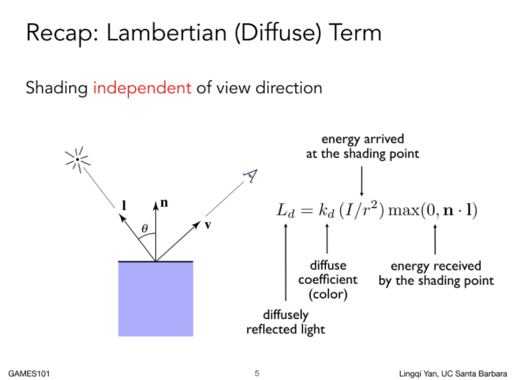
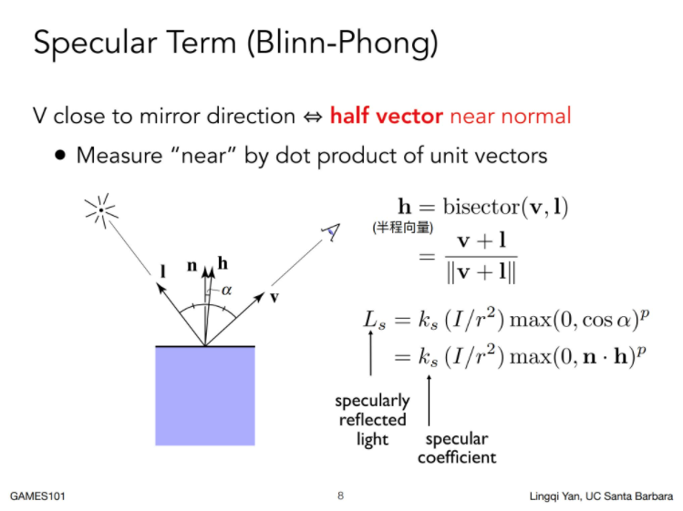
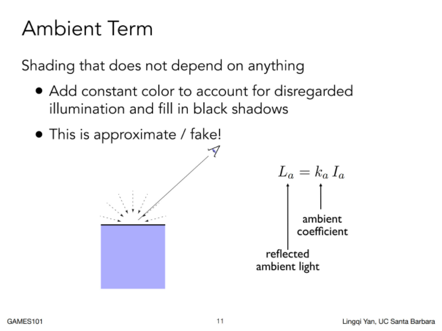
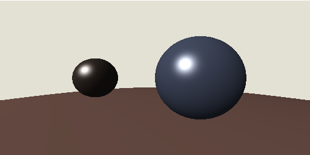

# Blinn-Phong反射模型

## 理论部分

**物体能被我们看到，是因为人眼接收到了从物体来的光**

我们可以简单的把物体反射的光分成三类：

1. 漫反射
2. 镜面反射
3. 环境光

### 漫反射

漫反射是光从一定角度入射之后向四面八方反射，且每个方向反射的光强度相等



### 镜面反射

与漫反射不同的是，镜面反射中观察方向是很重要的



### 环境光

Blinn-Phone模型里面泛光项不受任何其他因素影响，可以理解为一个常量



## 代码实现

同样的，我们新建一个材质文件 `src/material/blinn-phone-material.ts` :

```typescript
import { Illumination } from "../light/illumination";
import { Ray } from "../math/ray";
import { Vec3 } from "../math/vec3";
import { BaseMeterial } from "./base-material";

export class BlinnPhoneMaterial extends BaseMeterial {

    public constructor(diffuse: Vec3, specular: Vec3, p: number, ambient: Vec3) {
        super();
        this.diffuse = diffuse;
        this.specular = specular;
        this.p = p;
        this.ambient = ambient;
    }

    public readonly diffuse: Vec3;
    public readonly specular: Vec3;
    public readonly p: number;
    public readonly ambient: Vec3;

    public shade(ray: Ray, light: Illumination, position: Vec3, normal: Vec3): Vec3 {
        const NdotL = normal.normalize().dot(light.direction.negate());
        const diffuse = this.diffuse.multiply(Math.max(0, NdotL));

        const h = light.direction.add(ray.direction.normalize()).negate().normalize();
        const NdotH = normal.normalize().dot(h);
        const specular = this.specular.multiply(Math.pow(Math.max(0, NdotH), this.p));

        return this.ambient.add(light.color.modulate(diffuse.add(specular)));
    }
}
```

然后我们将 `BaseScene` 中的三个球赋上船新的材质：

```typescript
const color1 = new Vec3(0.271, 0.22, 0.196);
const color2 = new Vec3(0.325, 0.369, 0.478);
const color3 = new Vec3(0.682, 0.498, 0.427);

ball1.meterial = new BlinnPhoneMaterial(
    color1.multiply(0.6),
    new Vec3(1, 1, 1),
    30,
    color1.multiply(0.2),
);

ball2.meterial = new BlinnPhoneMaterial(
    color2.multiply(0.6),
    new Vec3(1, 1, 1),
    50,
    color2.multiply(0.2),
);

ball3.meterial = new BlinnPhoneMaterial(
    color3.multiply(0.6),
    new Vec3(1, 1, 1),
    80,
    color3.multiply(0.2),
);
```

编译一波，结果如下：



感jio还阔以，但是差点意思，毕竟是局部着色，为了更加真实逼真的效果，我们可能需要处理一下反射的部分，但是在此之前，我们先对画面进行抗锯齿处理