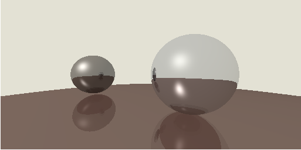

# 光线的多重反射

在之前的计算中, 我们并没有考虑光线在物体之间的多重反射,为此我们需要将现有的 `shade-pass` 进行小小的改造

首先我们给 `BlinnPhoneMaterial` 添加一个反射系数:

```typescript
// src/material/blinn-phone-material.ts

public constructor(diffuse: Vec3, specular: Vec3, p: number, ambient: Vec3, reflcetivity: number) {
    super();
    this.diffuse = diffuse;
    this.specular = specular;
    this.p = p;
    this.ambient = ambient;
    this.reflcetivity = reflcetivity;
}

public readonly diffuse: Vec3;
public readonly specular: Vec3;
public readonly p: number;
public readonly ambient: Vec3;
public readonly reflcetivity: number;
```

```typescript
// src/material/base-material.ts

export abstract class BaseMeterial {

    public abstract shade(ray: Ray, light: Illumination, position: Vec3, normal: Vec3): Vec3;

    public reflcetivity?: number;

}
```

在 `ShadePass` 中, 我们在计算某一点的着色时, 只要在碰到反射率非零的材质，就继续向反射的方向进行光线追踪，并把着色结果按反射率进行加权:

```typescript
export class ShadePass extends BasePass<IScene, IShadeOutput> {

    public process() {
        const shaded = new FrameBuffer();
        const { camera, nodes, light } = this.input;
        const { width, height } = shaded;

        shaded.walk((x, y) => {
            const ray = camera.generateRay(x, y, width, height);
            return this.rayTrace(0, ray);
        });
        this._output = { shaded };
    }

    public rayTrace(reflectTime: number, ray: Ray): Vec3 {
        const { nodes, light } = this.input;
        const hitResult = BaseGeometry.hitMulti(ray, nodes);

        if (Object.is(hitResult, IntersectResult.NONE)) {
            return new Vec3(0.89, 0.882, 0.831);
        }

        const material = hitResult.target.meterial;
        const { normal, hitPoint } = hitResult;

        const color = material.shade(
            ray,
            light.at(hitPoint),
            hitPoint,
            normal.normalize()
        );

        if (reflectTime >= MAX_REFLECT_TIME) {
            return color;
        }
        const reflcetivity = hitResult.target.meterial.reflcetivity;
        if (!reflcetivity) {
            return color;
        }
        const reflectDir = hitResult.normal.multiply(
            -2 * hitResult.normal.dot(ray.direction)
        ).add(ray.direction);

        const reflectColor = this.rayTrace(reflectTime + 1, new Ray(hitResult.hitPoint, reflectDir));
        return color.multiply(1 - reflcetivity).add(reflectColor.multiply(reflcetivity));
    }
}
```

然后我们给 `BaseScene` 里面的物体加上反射率：

```typescript
// src/scenes/BaseScene.ts

ball1.meterial = new BlinnPhoneMaterial(
    color1.multiply(0.6),
    new Vec3(1, 1, 1),
    30,
    color1.multiply(0.2),
    0.5
);

ball2.meterial = new BlinnPhoneMaterial(
    color2.multiply(0.6),
    new Vec3(1, 1, 1),
    50,
    color2.multiply(0.2),
    0.8
);

ball3.meterial = new BlinnPhoneMaterial(
    color3.multiply(0.6),
    new Vec3(1, 1, 1),
    80,
    color3.multiply(0.2),
    0.2
);
```

编译一波，浏览器刷新一下：



完美，但不完全完美，我们的图像锯齿有点严重，接下来我们要进行抗锯齿处理