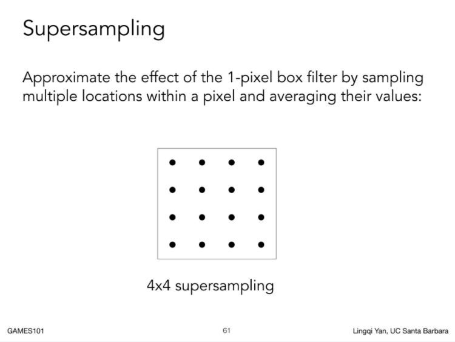
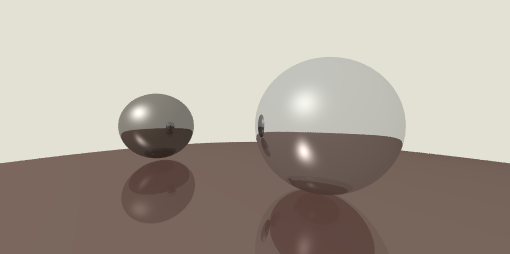

# 超采样抗锯齿

SSAA(Super-Sampling Anti-aliasing)，也就是“超采样抗锯齿”，即将游戏分别率渲染到更高的分辨率，再对放大后的图像像素进行采样，一般选取2个或4个邻近像素，把这些采样混合起来后生成最终像素，再将画面缩小为当前分辨率。说白了就是多采样几次然后求平均



目前我们的相机是从每一个像素点的中心发射了一条射线到场景中，为了实现超采样的效果，我们添加一个 `generateMultiRay` 函数用来发射多条光线，至于多条光线如何生成，我们听天由命（`Math.random()`）：

```typescript
// src/utils/perspective-camera.ts

public generateMultiRay(x: number, y: number, width: number, height: number) {
    const rays: Ray[] = [];
    for (let i = 0; i < SAMPLES_PER_PIXEL; i++) {
        const u = (x + Math.random()) / width;
        const v = (y + Math.random()) / height;
        rays.push(
            new Ray(this.origin, this.origin
                .add(this.front.multiply(this.near))
                .add(this.right.multiply(this._w * (u - 0.5)))
                .add(this.up.multiply(this._h * (v - 0.5))))
        );
    }
    return rays;
}
```

然后我们新建一个pass来实现多重采样，新建 `src/render/pass/ssaa-pass.ts` 文件：

```typescript
import { Vec3 } from "../../math/vec3";
import { FrameBuffer } from "../../utils/frame-buffer";
import { SAMPLES_PER_PIXEL } from "../../utils/macros";
import { ShadePass } from "./shade-pass";

export class SSAAPass extends ShadePass {

    public process() {
        const shaded = new FrameBuffer();
        const { camera, nodes, light } = this.input;
        const { width, height } = shaded;

        shaded.walk((x, y) => {
            let color = Vec3.zero;

            const rays = camera.generateMultiRay(x, y, width, height);

            rays.forEach(ray => {
                color = color.add(this.rayTrace(0, ray));
            });

            return color.divide(SAMPLES_PER_PIXEL);
        });
        this._output = { shaded };
    }
}
```

把之前管线中的 `ShadePass` 替换为 `SSAAPass` , 编译一波：



上图是 `SAMPLES_PER_PIXEL` 设为20的效果，感jio还阔以