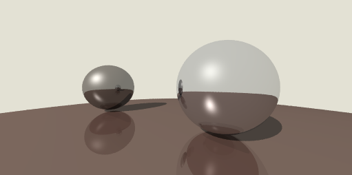

# 硬阴影的实现

到目前为止，场景中的物体还无法产生阴影，这是因为我们在进行着色计算时，没有考虑到光源被遮蔽的情况，我们来着手处理这一点

如何判断一个点是否处在阴影中呢？其实道理很简单，从这一点向光源方向发射一条射线，检查这射线与场景的碰撞点，如果碰撞点不存在，或者该点到碰撞点的距离大于到光源的距离，那么这点就不在阴影中，反之则在阴影中。

在 `ShadePass` 中添加一个 `getIllumination` 函数：

```typescript
// src/render/pass/shade-pass.ts

public getIllumination(position: Vec3) {
    const { nodes } = this.input;
    const light = this.input.light as PointLight;
    const ray = new Ray(position, light.position.subtract(position));

    const hitResult = BaseGeometry.hitMulti(ray, nodes);
    if (Object.is(hitResult, IntersectResult.NONE)) {
        return light.at(position);
    }

    if (hitResult.distance >= light.position.subtract(position).length) {
        return light.at(position);
    }

    return new Illumination(new Vec3(0, 0, 0), position.subtract(light.position));
}
```

我们将原来获取光照的地方替换为这个函数，编译一波，可以得到以下结果：



现在我们的物体可以产生阴影了，但这与我们在现实生活中看到的阴影有点不同，我们渲染得到的阴影太”硬“了，为了得到更加真实的”软“阴影，我们需要一点新的magic