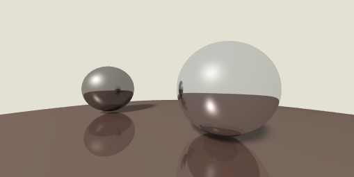

# 分布式光线追踪

## 软阴影的实现

目前我们计算小球投射的阴影，是通过判断某一点与光源的连线是否被其它物体阻挡来实现的。判断的结果只有“是”或“否”两种可能，也就是说某一点只有被照亮和不被照亮两种状态，而不可能被“部分”照亮，因此阴影就会显得很“硬”。为了实现“部分”照亮的效果，我们来尝试给光源加上一个“体积”。

首先我们给 `BaseLight` 加上一个新的函数 `sample()`,用来给某一点的光照进行采样：

```typescript
export abstract class BaseLight {
    public abstract at(position: Vec3): Illumination;

    public abstract sample(): Vec3;
}
```

然后我们给 `PointLight` 加上一个半径，用来表示点光源的“体积”：

```typescript
// src/light/point-light.ts

public constructor(position: Vec3, color: Vec3, decay: (distance: number) => number, radius = 0) {
    super();
    this.position = position.clone();
    this.color = color.clone();
    this.decay = decay;
    this.radius = radius;
}

public radius: number;
```

采样函数的实现，我们还是听天由命（`Math.random()`）：

```typescript
// src/light/point-light.ts

public sample(): Vec3 {
    return this.position.add(
        new Vec3(
            Math.random(),
            Math.random(),
            Math.random(),
        ).normalize().multiply(this.radius)
    );
}
```

接下来我们来改造 `ShadePass` 的 `getIllumination` 函数：

```typescript
// src/render/pass/shade-pass.ts

public getIllumination(position: Vec3) {
    const { nodes } = this.input;
    const light = this.input.light;

    let lightCount = 0;
    for (let i = 0; i < DRT_RAYS_COUNT; i++) {
        const pos = light.sample();
        const ray = new Ray(position, pos.subtract(position));
        const hitResult = BaseGeometry.hitMulti(ray, nodes);
        if (Object.is(hitResult, IntersectResult.NONE)) {
            lightCount++;
            continue;
        }
        if (hitResult.distance >= pos.subtract(position).length) {
            lightCount++;
            continue;
        }
    }

    const illuminate = light.at(position);
    illuminate.color = illuminate.color.multiply(lightCount / DRT_RAYS_COUNT);

    return illuminate;
}
```

这里主要的改动是，为了获取某一点的光照，我们在光源体积内随机采样，并将采样后的结果平均，以实现部分光照的效果。

最后我们给之前的点光源一个体积：

```typescript
// src/scenes/BaseScene.ts

this.light = new PointLight(
    new Vec3(-100, 100, 100),
    new Vec3(1, 1, 1),
    distance => 1,
    50,
);
```

编译一波，我们的阴影软起来了：



## 让反射也“软”起来

现在我们的小球看起来如同完美的镜面一般，这是因为我们在计算反射项的时候，假定光线只按照反射方向进行传播。但实际上物体的表面可能是粗糙的，光线会朝着各个方向进行反射。为了模拟光线的这种不规则反射，我们给材质加上一个 `roughness` 属性，然后根据这属性，给反射光线一定的随机偏移。

首先我们修改一下 `BaseMeterial` :

```
export abstract class BaseMeterial {
    public abstract shade(ray: Ray, light: Illumination, position: Vec3, normal: Vec3): Vec3;

    public reflcetivity?: number;

    public roughness?: number;
}
```

然后我们将 `ShadePass` 里面计算反射光线的部分进行改造：

```typescript
// src/render/pass/shade-pass.ts

public rayTrace(reflectTime: number, ray: Ray): Vec3 {
    const { nodes, light } = this.input;
    const hitResult = BaseGeometry.hitMulti(ray, nodes);

    if (Object.is(hitResult, IntersectResult.NONE)) {
        return new Vec3(0.89, 0.882, 0.831);
    }

    const material = hitResult.target.meterial;
    const { normal, hitPoint } = hitResult;

    const color = material.shade(
        ray,
        this.getIllumination(hitPoint),
        hitPoint,
        normal.normalize()
    );

    if (reflectTime >= MAX_REFLECT_TIME) {
        return color;
    }
    const reflcetivity = hitResult.target.meterial.reflcetivity;
    if (!reflcetivity) {
        return color;
    }
    const reflectColor = this.getReflectColor(hitResult, ray, reflectTime + 1);
    return color.multiply(1 - reflcetivity).add(reflectColor.multiply(reflcetivity));
}

private getReflectColor(hitResult: IntersectResult, ray: Ray, reflectTime: number) {
    const roughness = hitResult.target.meterial.roughness;

    const reflectDir = hitResult.normal.multiply(
        -2 * hitResult.normal.dot(ray.direction)
    ).add(ray.direction);

    if (!roughness) {
        const reflectColor = this.rayTrace(reflectTime, new Ray(hitResult.hitPoint, reflectDir));
        return reflectColor;
    }

    const len = Math.random() * roughness * MAX_DIFFUSE_RATE;
    let color = Vec3.zero;
    for (let i = 0; i < DRT_RAYS_COUNT; i++) {
        const dir = reflectDir.add(new Vec3(
            Math.random() * len,
            Math.random() * len,
            Math.random() * len,
        ));
        color = color.add(this.rayTrace(reflectTime, new Ray(hitResult.hitPoint, dir)));
    }
    return color.divide(DRT_RAYS_COUNT);

}
```

在 `getReflectColor` 函数中，我们随机生成了多条反射光线，然后对其结果进行了加权，用来作为最终的结果。

最后我们在 `BaseScene` 里面给小球加上 `roughness` 属性：

```typescript
// src/scenes/BaseScene.ts

ball1.meterial = new BlinnPhoneMaterial(
    color1.multiply(0.6),
    new Vec3(1, 1, 1),
    30,
    color1.multiply(0.2),
    0.5,
    0.2
);

ball2.meterial = new BlinnPhoneMaterial(
    color2.multiply(0.6),
    new Vec3(1, 1, 1),
    50,
    color2.multiply(0.2),
    0.8,
    0.3
);

ball3.meterial = new BlinnPhoneMaterial(
    color3.multiply(0.6),
    new Vec3(1, 1, 1),
    80,
    color3.multiply(0.2),
    0.2,
    0.5
);
```

编译一波：


效果看上去好多了，但现在我们的编译时间有点过长了，我们来做点小小的改进